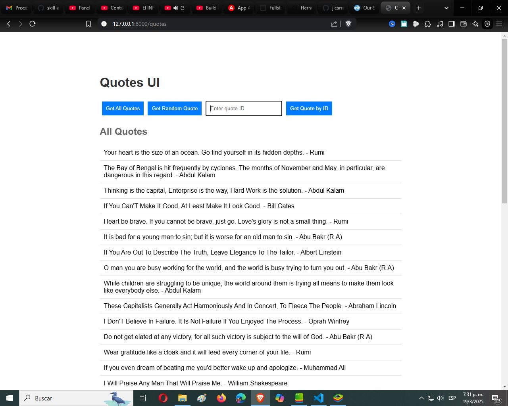
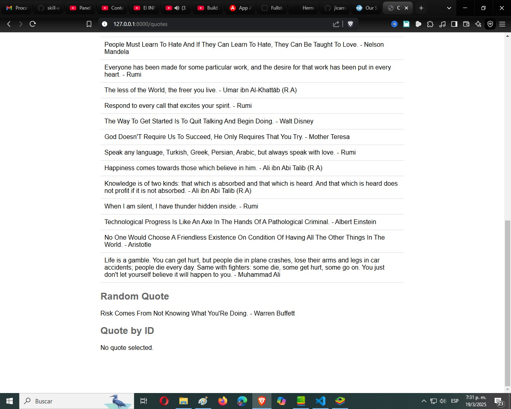
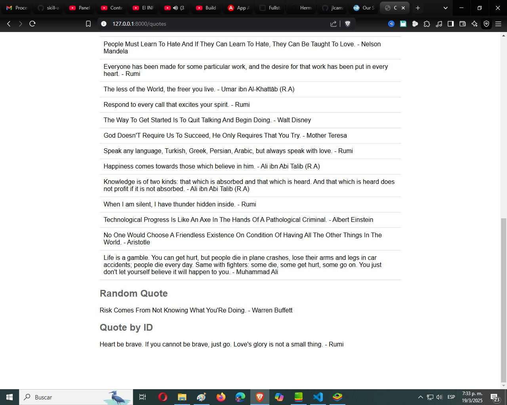

# Laravel Quotes Package

A Laravel package for interacting with the [dummyjson.com quotes API](https://dummyjson.com/quotes), featuring a robust API service with caching, rate limiting, and binary search, alongside a Vue.js-powered user interface.

---

## Features
- **API Service:** Fetch all quotes, random quotes, or specific quotes by ID from the dummyjson.com API.
- **Caching:** Local caching of quotes with binary search for efficient retrieval.
- **Rate Limiting:** Built-in rate limiting to prevent API abuse.
- **API Routes:** RESTful endpoints (`/api/quotes`, `/api/quotes/random`, `/api/quotes/{id}`).
- **Vue.js UI:** Interactive frontend to display quotes, built with Vite.

---

## Requirements
- PHP >= 8.2
- Laravel 11.x
- Node.js & npm (for building the Vue.js UI)
- Composer

---

## Installation

Follow these steps to install and configure the package in your Laravel application:

### Step 1: Install via Composer
Add the package to your project:

```bash
composer require jjmartinezf/quotes
```

If you're developing locally or using a custom version, add it as a path repository in your `composer.json`:

```json
"repositories": [
    {
        "type": "path",
        "url": "../laravel-quotes-package"
    }
],
"require": {
    "jjmartinezf/quotes": "@dev"
}
```

Then run:

```bash
composer update
```

### Step 2: Publish Package Assets

Publish the configuration file, frontend assets, and views:

```bash
php artisan vendor:publish --tag=config
```
_Copies `quotes.php` to `config/quotes.php`. Edit this file to customize the API URL or rate limits if needed._

```bash
php artisan vendor:publish --tag=assets
```
_Copies the compiled Vue.js assets (`dist/`) to `public/vendor/quotes`._

```bash
php artisan vendor:publish --tag=views
```
_Copies the Blade view (`quotes.blade.php`) to `resources/views/vendor/quotes`._

### Step 3: Build the Vue.js UI (Optional)

If you modify the Vue.js source code (e.g., `resources/js/App.vue`), rebuild the assets:

Navigate to the package directory:
- If installed via Composer: `cd vendor/jjmartinezf/quotes`.
- If using a local path: `cd path/to/laravel-quotes-package`.

Install dependencies and build:

```bash
npm install
npm run build
```

Republish the assets:

```bash
php artisan vendor:publish --tag=assets --force
```

_Note: If you're using the pre-built assets from the package, skip this step._

---

## Usage

### Accessing the UI

Add this route to your `routes/web.php` to display the Vue.js interface:

```php
use Illuminate\Support\Facades\Route;

Route::get('/quotes', function () {
    return view('vendor.quotes.quotes');
});
```

Visit `http://your-app-url/quotes` in your browser to see the UI.
The interface includes buttons to fetch all quotes, a random quote, or a specific quote by ID.

### API Endpoints

The package provides the following RESTful API endpoints:

#### Get All Quotes:
```http
GET /api/quotes
```
_Returns a JSON array of all quotes._

#### Get Random Quote:
```http
GET /api/quotes/random
```
_Returns a JSON object with a single random quote._

#### Get Quote by ID:
```http
GET /api/quotes/{id}
```
_Returns a JSON object with the quote matching the specified ID, or `null` if not found._

#### Example using cURL:

```bash
curl http://your-app-url/api/quotes
curl http://your-app-url/api/quotes/random
curl http://your-app-url/api/quotes/1
```

---

## Screenshots

Below are examples of the Vue.js UI in action:

### 1. All Quotes
_Displays the full list of quotes fetched from `/api/quotes`._



### 2. Random Quote
_Shows a single random quote fetched from `/api/quotes/random`._



### 3. Quote by ID
_Displays a specific quote fetched from `/api/quotes/{id}` (e.g., ID 1)._



---

## Configuration

The package includes a configuration file at `config/quotes.php`:

```php
return [
    'api_url' => env('QUOTES_API_URL', 'https://dummyjson.com'),
    'rate_limit' => env('QUOTES_RATE_LIMIT', 100),
    'rate_window' => env('QUOTES_RATE_WINDOW', 60),
];
```

- `api_url`: Base URL for the quotes API (default: `https://dummyjson.com`).
- `rate_limit`: Maximum requests allowed per window (default: 100).
- `rate_window`: Time window in seconds for rate limiting (default: 60).

Override these values in your `.env` file:

```env
QUOTES_API_URL=https://custom-api.com
QUOTES_RATE_LIMIT=50
QUOTES_RATE_WINDOW=30
```

---

## Development Progress

- **Hour 1:** Initial package setup with Composer, QuotesServiceProvider, config, and Vue.js with Vite.
- **Hour 2:** Implemented QuotesApiService with `getAllQuotes`, `getRandomQuote`, `getQuote`, and basic caching.
- **Hour 3:** Added rate limiting and binary search to QuotesApiService.
- **Hour 4:** Added API routes and QuotesController.
- **Hour 5:** Setup Vue.js UI with fetch all quotes functionality.
- **Hour 6:** Completed Vue.js UI with random quote and quote by ID.
- **Hour 7:** Made assets publishable, added view, and successfully tested package in Laravel 11 app.
- **Hour 8:** Final adjustments, detailed documentation, and screenshots added.

---

## Contributing

Feel free to fork the repository, submit pull requests, or report issues on GitHub.

**Javier J. Martinez F.**
*Full Stack Developer*
Venezuela

---
